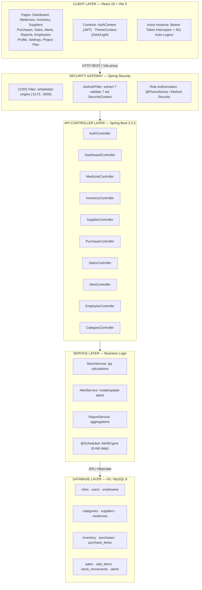
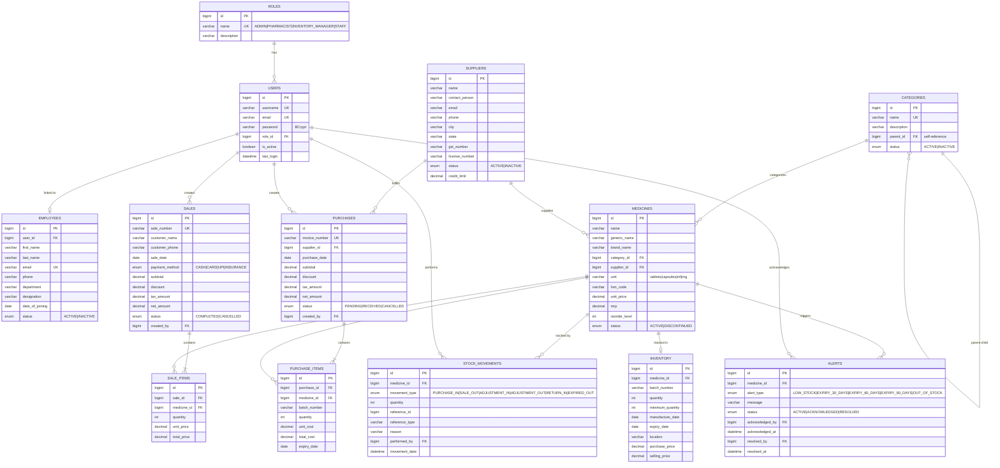
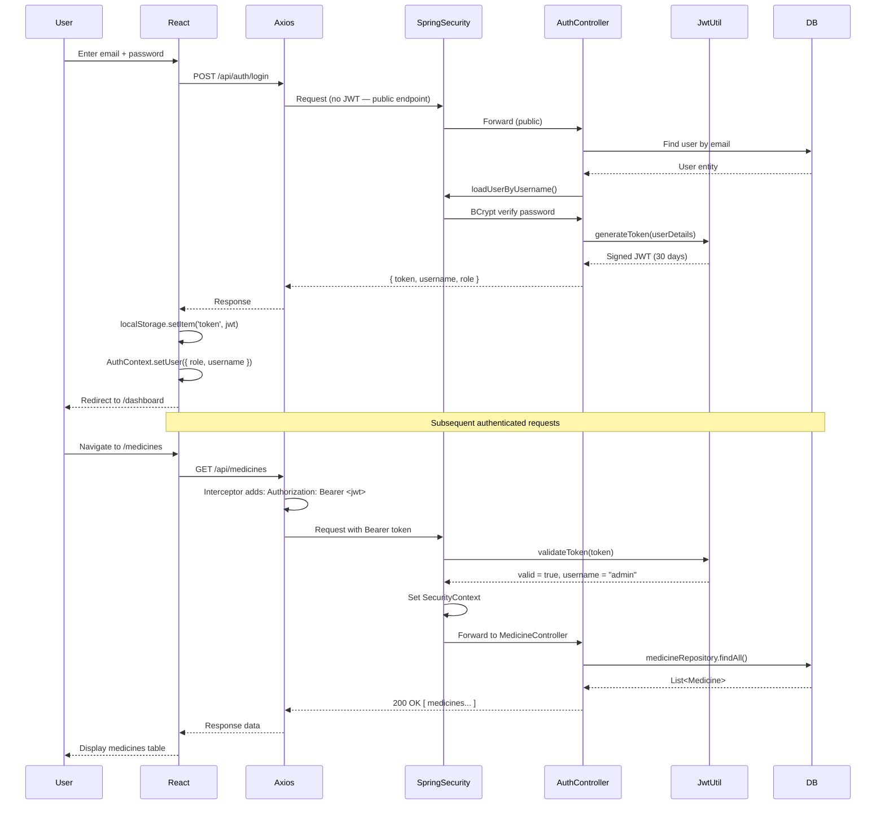
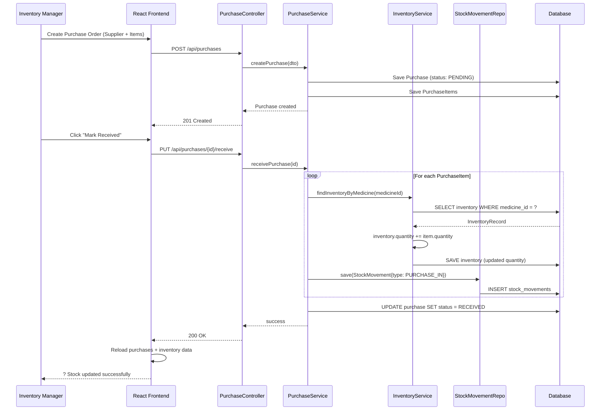
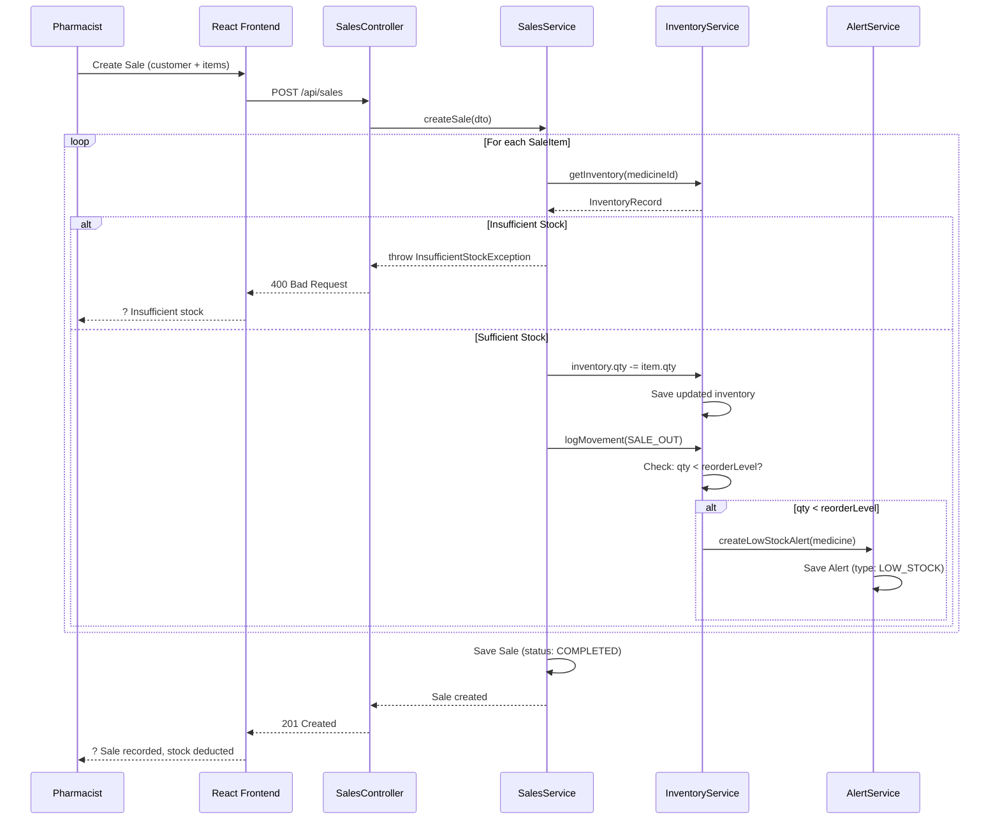
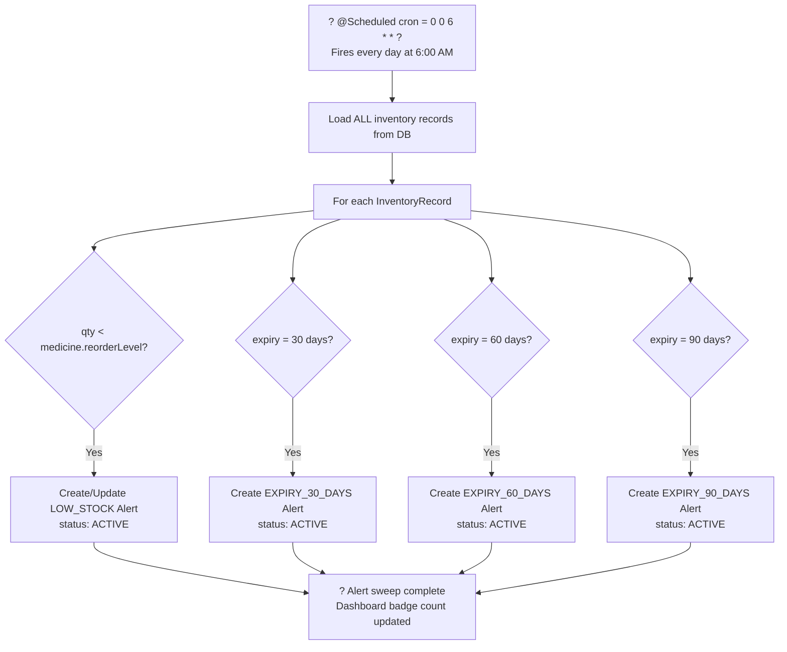

# MediStock Pro — Medical Inventory Management Platform
## Diagrams & Architecture Documentation
### Infosys Springboard Internship | B.Tech Computer Science Engineering

---

## 1. Application Workflow Diagram

```mermaid
flowchart TD
    A([?? User]) --> B{Has Account?}
    B -- No --> C[Register with Role]
    C --> D[Account Created]
    D --> E
    B -- Yes --> E[Login: Email + Password]
    E --> F{JWT Valid?}
    F -- No --> G[? Auth Error ? Redirect to Login]
    F -- Yes --> H[JWT Token Issued & Stored]
    H --> I[?? Dashboard — KPI Cards + Charts]

    I --> J{Select Module}

    J --> K[?? Medicine Management]
    K --> K1[Search / Filter / CRUD]
    K1 --> K2[Update Category & Supplier links]

    J --> L[?? Inventory Management]
    L --> L1[View All / Low Stock / Expiring tabs]
    L1 --> L2{Stock Low?}
    L2 -- Yes --> L3[?? LOW_STOCK Alert Generated]
    L1 --> L4{Near Expiry?}
    L4 -- Yes --> L5[?? EXPIRY Alert Generated]
    L1 --> L6[Manual Stock Adjustment with Reason]

    J --> M[?? Supplier Management]
    M --> M1[CRUD Supplier Profiles]
    M1 --> M2[GST, License, Contact, City, Rating]

    J --> N[?? Purchase Management]
    N --> N1[Create Purchase Order]
    N1 --> N2[Select Supplier + Add Medicine Items]
    N2 --> N3{Mark as RECEIVED?}
    N3 -- Yes --> N4[? Auto Increase Inventory +qty]
    N4 --> N5[?? Log StockMovement: PURCHASE_IN]
    N3 -- Cancel --> N6[? Purchase CANCELLED]

    J --> O[?? Sales Management]
    O --> O1[Create Sale: Multi-item cart]
    O1 --> O2{Sufficient Stock?}
    O2 -- No --> O3[? Block Sale: Insufficient Stock]
    O2 -- Yes --> O4[Record Sale Items + Payment Method]
    O4 --> O5[? Auto Deduct Inventory -qty]
    O5 --> O6[?? Log StockMovement: SALE_OUT]
    O6 --> O7{qty < reorderLevel?}
    O7 -- Yes --> O8[?? Auto-create LOW_STOCK Alert]

    J --> P[?? Reports & Analytics]
    P --> P1[Select Report Type]
    P1 --> P2[Set Date Range Filter]
    P2 --> P3[Generate Report from Database]
    P3 --> P4[Export PDF / CSV Download]

    J --> Q[?? Employee Management]
    Q --> Q1[CRUD Employee Profiles]
    Q1 --> Q2[Link User Account & Role]

    J --> R[?? Alert Center]
    R --> R1[View Active Alerts]
    R1 --> R2[Acknowledge Alert]
    R2 --> R3[Resolve Alert]

    J --> S[?? Scheduled Alert Engine]
    S --> S1[@Scheduled - Daily at 6 AM]
    S1 --> S2[Scan all Inventory Records]
    S2 --> S3{qty < reorderLevel?}
    S3 -- Yes --> S4[Create LOW_STOCK Alert]
    S2 --> S5{Expiry = 30/60/90 days?}
    S5 -- Yes --> S6[Create EXPIRY Alert]
```

---

## 2. System Architecture Layers



---

## 3. Entity Relationship Diagram (ERD)



---

## 4. JWT Authentication Sequence Diagram



---

## 5. Purchase ? Stock Update Flow



---

## 6. Sale ? Auto Stock Deduction Flow



---

## 7. Scheduled Alert Engine Flow



---

*MediStock Pro — Diagrams & Architecture | Infosys Springboard Internship | B.Tech CSE*
