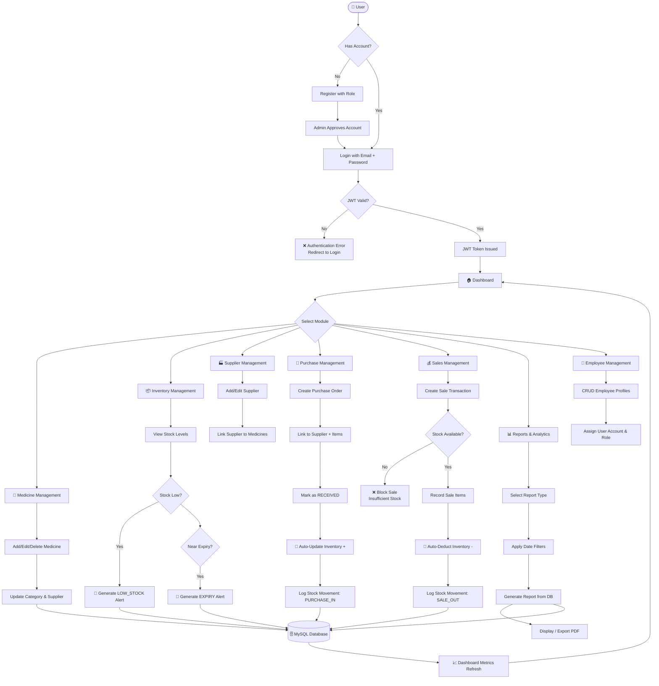
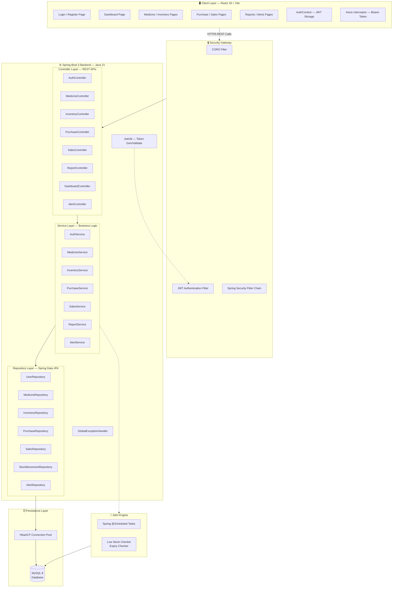
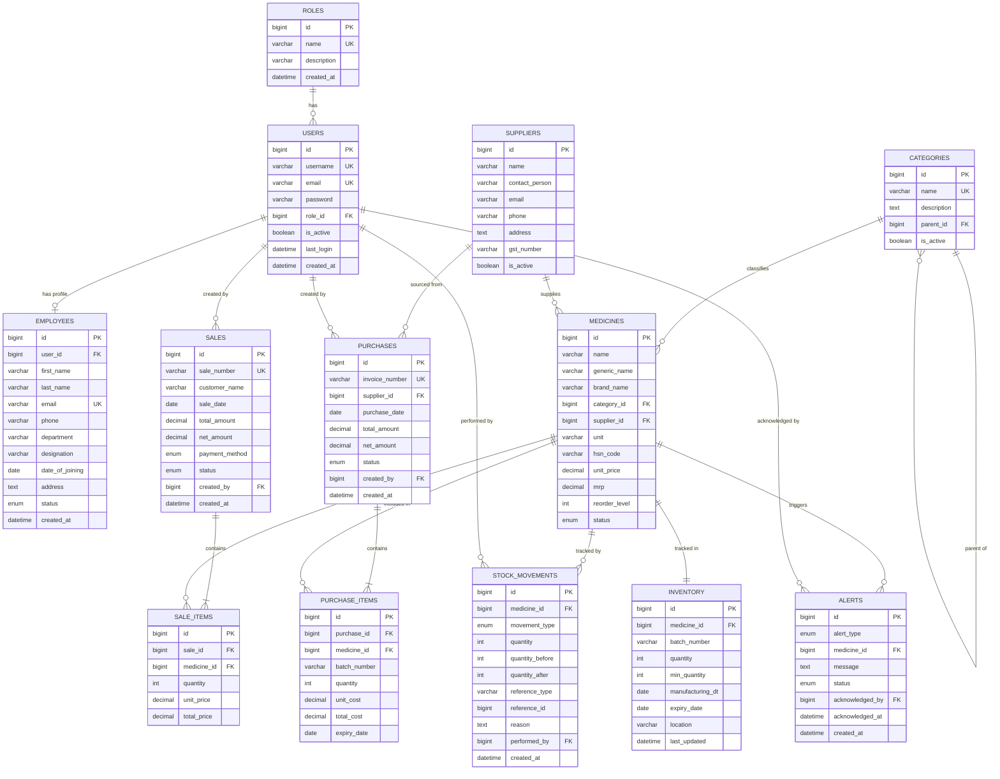
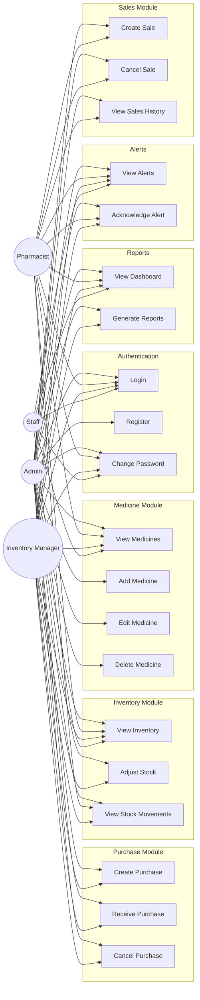
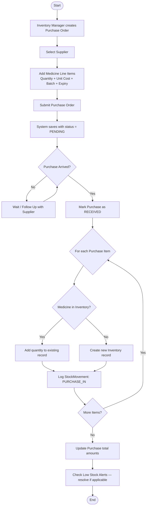
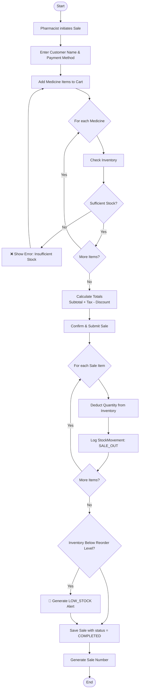

# Medical Inventory Management Platform
## Diagrams — Week 1

---

## 1. Workflow Diagram

---

## 2. System Architecture Diagram

---

## 3. ER Diagram (Entity Relationship)

---

## 4. Use Case Diagram (Textual with Mermaid)

---

## 5. Activity Diagram — Purchase Receiving Flow

---

## 6. Activity Diagram — Sale Transaction Flow

